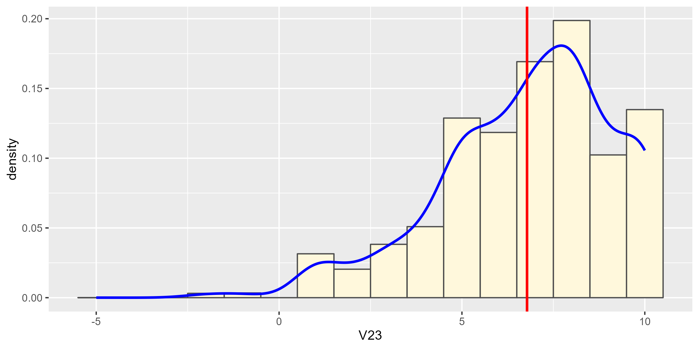

------------------------------------------------------------------------

本次作业采用"WVS(World Values Survey)"的数据，并运用基础数据频次统计和数据可视化，对WVS数据中不同国家人民的生活满意度数据进行初步分析。进而了解：哪一个国家拥有最高或最低的生活满意度？

# step 1：环境准备

```{r step 1, message=FALSE}
# 清除当前镜像中的数据
rm(list = ls())

# 装载必要的包
library(moments)     # skewness、kurtosis
library(ggplot2)     # 可视化
library(tidyverse)   # %>%
library(mosaic)      # mean、median、sd
library(sjlabelled)  # 可视化
```

# step 2：读取数据

```{r step 2}
# 读取数据
WVS <- readRDS("0 Visualization_data_WVS.rds")

# 去重，取各国名并计算国家个数
WVS.countries.names <- names(attributes(WVS$V2A)$labels)
WVS %>% distinct(V2A) %>% glimpse
```

# step 3：筛选变量

```{r step 3}
# 用tidyverse包中的select函数筛选变量，glimpse函数展示
WVS.frame <- WVS %>% select(V2A, V23) %>% glimpse()
```

# step 4：计算统计量

```{r step 4}
# 计算各统计量，前三来自mosaic包，后二来自moments包
WVS.median <- median(WVS$V23)        # 中位数
WVS.mean <- round(mean(WVS$V23), 3)  # 平均数
WVS.sd <- round(sd(WVS$V23), 3)      # 标准差
WVS.skewness <- round(skewness(WVS$V23), 3)  # 偏度系数
WVS.kurtosis <- round(kurtosis(WVS$V23), 3)  # 峰度系数

cat(
  "median: ", WVS.median, "\n",
  "mean: ", WVS.mean, "\n",
  "standard deviation: ", WVS.sd, "\n",
  "skewness: ", WVS.skewness, "\n",
  "kurtosis: ", WVS.kurtosis, "\n",
  sep = ""
)

# 平均值和中位数都在7左右，表明该值普遍较高
# 标准差为2.365，有些许的波动
# 偏度系数为负，说明低于均值的数据更多或可能有极端值
# 峰度系数大于3，观察量较为集中
```

# step 5：绘制直方图

```{r step 5, fig.show='hide'}
# 用ggplot2包画出直方图、密度曲线和均值线
ggplot(WVS.frame, aes(x = as.integer(V23), y = after_stat(density))) +
  geom_histogram(fill = "cornsilk", color = "grey30", binwidth = 1) +
  geom_line(stat = "density", adjust = 3, color = "blue", linewidth = 1) +
  geom_vline(xintercept = WVS.mean, color = "red", linewidth = 1) +
  labs(x = "V23")

# 调整大小，保存为图片
ggsave("density.png", width = unit(8, "cm"), height = unit(4, "cm"))
```



```{r explain 5}
# 结合直方图来看，密度曲线在5之后急速上升且持续走高，说明打分大多集中在5分以上
# 多数人对其国家满意度在及格线之上
# 平均值左侧“尾巴”较长，偏离较多，可能有极端值（负数）；平均值右侧较为集中
```

# step 6：绘制各国均值的条形图

```{r step 6, fig.show='hide'}
# 用聚集函数计算各国V23的平均值
WVS.count <- aggregate(WVS.frame, by = list(WVS.frame$V2A), mean)

# 将V2A中的数值转换为国名
WVS.count$V2A <- WVS.countries.names[factor(WVS.count$V2A)]

# 画出条形图，根据V23平均值从小到大排列
ggplot(WVS.count, aes(x = reorder(V2A, V23, decreasing = TRUE), y = V23)) +
  geom_bar(stat = "identity", fill = "cornsilk", color = "grey", linewidth = 0.2) +
  coord_flip() +
  geom_text(aes(label = round(V23, 2)), hjust = 1, size = 3) +
  theme(axis.title.x = element_text(size = 16)) +
  theme(axis.title.y = element_text(size = 16, angle = 0, hjust = 1, vjust = 0.5)) +
  labs(x = "V2A", y = "avg(V23)")

# 调整大小，保存为图片
ggsave("average.png", width = unit(8, "cm"), height = unit(16, "cm"))

# 可知，埃及最低，墨西哥最高
```


